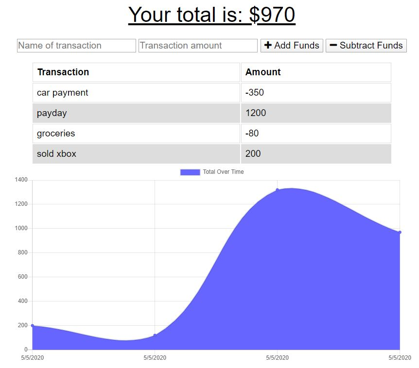

# Budget Tracker (PWA)

## Description

Budget Tracker is a progressive web application that allows users to track their budgets by adding expenses and deposits to their budget through the "Add/Subtract Funds" buttons. They are able to add a transaction with or without a connection. When a user enters a transaction while offline, these transactions are stored in the indexedDB, and transferred to the database when the user comes back online.

## Table of Contents

- [Installation](#installation)
- [Usage](#usage)
- [Example Usage](#example-usage)
- [License](#license)
- [Contributing](#contributing)
- [Questions](#questions)

## Installation

To install the required dependencies, run `npm install`

This package assumes there is a MongoDB server running on localhost:27017. If your server is running somewhere else, you can edit `server.js` to reflect that.

## Usage

To start the server, run `npm start`. To access the app after starting the server, go to http://localhost:3000 in your browser.

## Example Usage

Deployed App: https://immense-escarpment-03497.herokuapp.com/

An example screenshot of the application is below.

## License

This project is licensed under the MIT License - see the [LICENSE](LICENSE) file for details.

## Contributing

If you want to contribute, open a Pull Request and include a detailed description and screenshots of the changes.

## Questions

If you have any questions about the repo, open an issue or contact [ryan-harris](https://github.com/ryan-harris) directly at harris.ucla@gmail.com.
